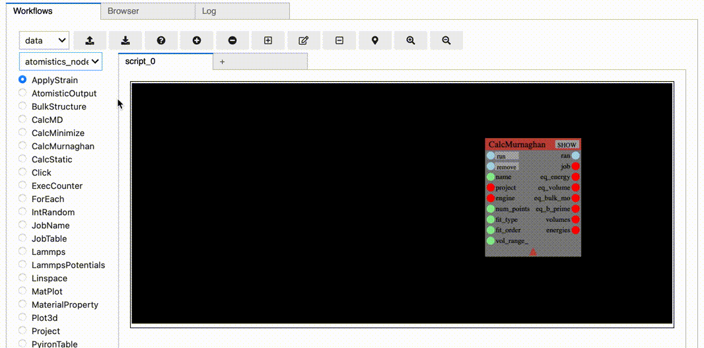

# Ironflow

[](https://mybinder.org/v2/gh/pyiron/ironflow/HEAD?labpath=example.ipynb)
[](https://opensource.org/licenses/BSD-3-Clause)
[](https://app.codacy.com/gh/pyiron/ironflow/dashboard)
[](https://coveralls.io/github/pyiron/ironflow?branch=main)
[](https://ironflow.readthedocs.io/en/latest/)

[](https://anaconda.org/conda-forge/ironflow)
[](https://anaconda.org/conda-forge/ironflow)
[](https://anaconda.org/conda-forge/ironflow)
[](https://anaconda.org/conda-forge/ironflow)

Ironflow combines [ryven](https://ryven.org), [ipycanvas](https://ipycanvas.readthedocs.io/) and [ipywidgets](https://ipywidgets.readthedocs.io/en/stable/) to provide a Jupyter-based visual scripting gui for running [pyiron](https://pyiron.org) workflow graphs.
This project is under active development, and in particular the set of nodes available for the workflow graphs is still limited. 
If there is a particular use-case you'd like to see, or if one of our nodes is not working as expected, please raise an issue!


In its current form, ironflow has some UI performance issues, especially when placing new nodes with many ports, or moving nodes around in a big graph.
(You can look at the movie demonstrating ontological typing below to get a sense of the delay for placing larger nodes.)
This is a [known issue](https://github.com/pyiron/ironflow/issues/143) and performance enhancements are currently our top priority -- both in terms of UI performance and underlying computations, e.g. we would like to exploit the latest pyiron developments for [running lammps without writing any files](https://github.com/pyiron/pyiron_lammps) in calculation nodes.

## Usage

The main gui can be imported directly from `ironflow`.

The gui takes a session title at instantiation, and will automatically try to load any saved session (a JSON file) with the same name present.
To visualize the gui, call the `draw` method.
E.g.:
```python
from ironflow import GUI
gui = GUI('example')
gui.draw()
```

The main screen for ironflow is used to build/run/save/load graphical pyiron workflows. 
In addition to manipulating the gui with buttons in the toolbar (hover the cursor over buttons for more info), you can:
- Look at a node's IO values by clicking on it (which selects it)
- Deselect things by clicking on empty space
- See a richer representation of the node by clicking its `SHOW` button
- Connect the IO (input/output) of a node by clicking on its port and then clicking on another node's OI port
- Move a node around by clicking and dragging it
- Pan the entire camera around by clicking and dragging empty space
- Add a new node of the selected type by double-clicking on empty space
- Delete a node by double-clicking on it
- Collapse or expand a node by clicking on the little triangle on its body (has no effect on functionality, just makes it take less space)
- Reset an (unconnected) input port's value to its default by clicking the refresh button in the node controller window.
- Change an input port to "batched" mode by clicking the corresponding button in the node controller window.

In the default `data` execution mode (we don't currently do anything with the `exec` mode, so don't worry about it), nodes will update their output whenever their input data changes.
You'll see the node body change color when it's performing this update.
Some nodes have input (or output) ports that are of the execution rather than data type.
These can be triggered by a signal from another node's exec-type output port, or by manually clicking the button associated with that port right there in the node widget.

In addition to the workflows screen, ironflow also incorporates the browser from [`pyiron_gui`](https://github.com/pyiron/pyiron_gui), as well as a log tab that allows you to turn the underlying ryven logger on/off and choose whether stdout gets routed to ironflow or its original context.

## Differences to Ryven

Ironflow is built on top of ryvencore 0.3.1.1.
There are a number of minor differences between ryven nodes and ironflow nodes discussed in the next section, but at a 
high level there are two significant differences:

### Data typing

All node ports are typed, and connection perform type-checking to ensure validity prior to establishing a connection.
By default, a special `Untyped` data type is used, which performs *all* validity checks by value, and thus does not allow pre-wiring of a graph without full data.
Further, the validity of the current value for each IO port is indicated by the port color: green for valid, red for invalid.

You can read the full spec for the typing rules the `ironflow.model.dtypes` module, but at a high level each port has 
one or more classes whose instances are valid input.
An output port can be connected to an input port as long as its valid classes are a strict subset of the input port's valid classes, and as long as the output port won't allow the the input port to be surprised by a `None` value.

This type checking is still under development and may be somewhat brittle.
Our goal is to extend this system to be dynamically informed by an ontology on top of the graph: instead of statically insisting that input be of type `float`, we instead demand that the ontological type of the energy be `surface energy` _dynamically_ because the output value of that port is used, e.g., to calculate a grain boundary interface energy.

### Ontological typing

Nodes can also optionally carry an "ontological type" (otype). 
Leaning on the [pyiron_ontology](https://github.com/pyiron/pyiron_ontology) library for representing knowledge in computational workflows, otypes give a rich _graph dependent_ representation of the data and facilitate guided workflow design.
This is fully demonstrated in the `bulk_modulus.ipynb` and `surface_energy.ipynb` notebooks, but a quick demo is also provided in the video below.

We see that there is a "recommended" tab for nodes.
After selecting this menu, clicking on the `CalcMurnaghan.engine` port populates the tab with nodes that have valid output for this port.
We can double-click to place the new node (`Lammps`) and repeat the process, e.g. for the `Lammps.structure` input.
Here we see there are two possibilities -- `BulkStructure` and `SlabStructure` -- and place both.
(Note, as mentioned at the head of the readme, there is some lag in ironflow right now; you can see this in the delay between the double-click and the placement of these larger nodes.)
Not only do we get recommendations for nodes to place in the graph, but we also get specific recommendations of which ports make valid connections!
Below we again select the `Lammps.structure` input port, and see that the output ports on both the structure nodes is highlighted.
Similarly, if we click the `Lammps.engine` output port, we see that all the valid input ports on our graph get highlighted; in this case, `CalcMurnaghan.input`.
Finally, we see the real power of otypes -- by connecting the two `engine` ports, the `Lammps` node now has access to the _ontological requirements_ of the `CalcMurnaghan` node!
In particular, `CalcMurnaghan` produces _bulk moduli_ and thus only works for calculations on _bulk structures_.
After these are connected, when we once again select the `Lammps.structure` input, _only_ the `BulkStructure` node gets highlighted, and _only_ `BulkStructure` appears in the recommended nodes window.



Of course, not all ports in ironflow are otyped, and indeed not all should be -- e.g. it doesn't make sense to ontologically-type the output of the `Linspace` node, as it is just providing numbers which may be useful in many contexts.
However, for nodes which specifically produce and require physically-/ontologically-meaningful data, otyping is a powerful tool for understanding workflows and guiding their design.

### Batching

Many ports can be "batched" by selecting them to open the node controller window and pressing the "batched" button.
This changes the expected input for the port from a single value to a list of values.
The node operation is then iterated over the entire list, and output values are correspondingly also turned to a list.

You can quickly see which ports are batched in the graph because their labels are converted to `ALL_CAPS` while unbatched ports are `all_lower_case`.

Any number of input ports can be batched on the same node as long as _all batches are of the same length_.

Batching impacts the type checking in a (hopefully) intuitive way: a batched output port of type `float` can be fed to a batched input port of type `float` but *not* to an _unbatched_ input port of type `float`.
Similarly, an unbatched port of type `list[float]` can be passed to an input port of type `float` only if that port is batched.
Only single values and 1D lists are supported right now, although support for higher order matrices of data is planned.


## Adding custom nodes

The tools needed for extending your graphs with new custom nodes can be imported as `from ironflow import node_tools`.
New nodes can be registered either from a list of nodes, or from a python module or .py file.
In the latter two cases, only those nodes that inherit from `Node` *and* have a class name ending in `_Node` will be registered (this allows you to have your own node class templates and avoid loading the template itself by simply using regular python CamelCase naming conventions and avoiding ending in `_Node`). 

A new node should have a `title` and may optionally have input and/or output channels specified.
If you want your node to actually *do* something, you'll also need to define an `update_event` method.
E.g.:

```python
from ironflow.node_tools import Node, NodeInputBP, NodeOutputBP, dtypes, input_widgets


class My_Node(Node):
    title = "MyUserNode"
    init_inputs = [
        NodeInputBP(dtype=dtypes.Integer(default=1), label="foo")
    ]
    init_outputs = [
        NodeOutputBP(label="bar")
    ]
    color = 'cyan'

    def update_event(self, inp=-1):
        self.set_output_val(0, self.input(0) + 42)


gui.register_node(My_Node)
```

Ironflow nodes differ from standard ryven (version 0.3.1.1) nodes in five ways:
- There is a new helper method `output` analogous to the existing `input` method that lets you more easily access output values, i.e. just a quality-of-life difference.
- Input/output ports and the port values are directly accessible as attributes *if* those ports were labeled, e.g. `node.inputs.ports.foo` or `node.outputs.values.bar`.
- They have a `representation` dictionary, which is used by the IPython gui front-end to give a richer look at nodes. By default, this includes all the outputs and the source code for the node, but you can append to or overwrite these values by specifying an `extra_representations` dictionary on your custom nodes.
- They have two new events: `before_update` and `after_update`, to which you can connect (e.g. `node.after_update.connect`) or disconnect (`...disconnect`) methods to fire before and/or after updates occur -- such methods must take the node instance itself as the first argument, and the canonical input integer (specifying which input value it is that's updating) as the second argument. (You can see an example of this in our base `Node` class, where we use it to force an update of the `representation` attribute after each node update.)
- It is strongly advised to specify a `dtype` for each of your nodes from among `node_tools.dtypes`.
- Ports have an additional `otype` field to facilitate ontologically-informed port and node suggestions.

Otherwise, they are just standard ryven nodes, and all the ryven documentation applies.

### Special nodes

We also have a number of special parent node classes available based of the meta-parent `BatchingNode`.
Instead of specifying the `update_event`, children of `BatchingNode` specify other functions so that the update can be automatically batched over.

The simples of these is `DataNode`, for which children specify the `node_function` method, which must take arguments based on the labels of input ports and returns a dictionary with keys based on the labels of output ports. 
Nodes of this type attempt to update themselves on placement, and will automatically update or clear (set to `None` their output ports based on whether or not all of their input ports report valid input values.

The others are `TakesJob` and `MakesJob`, children of which must specify `_modify_job` or `_generate_job` methods, respectively.
These nodes are designed to interact with pyiron's `GenericJob` objects in a functional way.
They also support batching, and will automatically populate `run` and `remove` buttons on the node widget, and lock the input after their owned job(s) are `run`.


## Structure

The code is broken into three main submodules:
- `model`, which provides and interface to and extensions of the ryven back-end
- `gui`, which has all the code for driving the back-end from the IPython visual interface
- `nodes`, which stores all the nodes that get included by default when you instantiate the gui/model

The `node_tools` submodule is just a wrapper to expose other parts of the code base in one easy-to-import-from spot.

The model itself, `HasSession`, is just a driver for a single ryven `Session`, with some helpful tools like the ability to easily register new nodes.

The gui inherits from and drives the model, and is broken down into three screens: workflows (which allow you to manipulate the model), browser (which wraps the project browser from `pyiron_gui`), and a log.
Inside the workflows screen, visual elements of the gui are broken down into subcomponents like the toolbar, a panel with a visual representation of the graph, a place to show the node representations, etc.
We avoid listing them all here because what's included and how it's laid out is still in flux.
The key conceptual bit is that these various sub-components do not rely directly on each other's internal implementation, they go through the workflow screen as an intermediary where necessary.