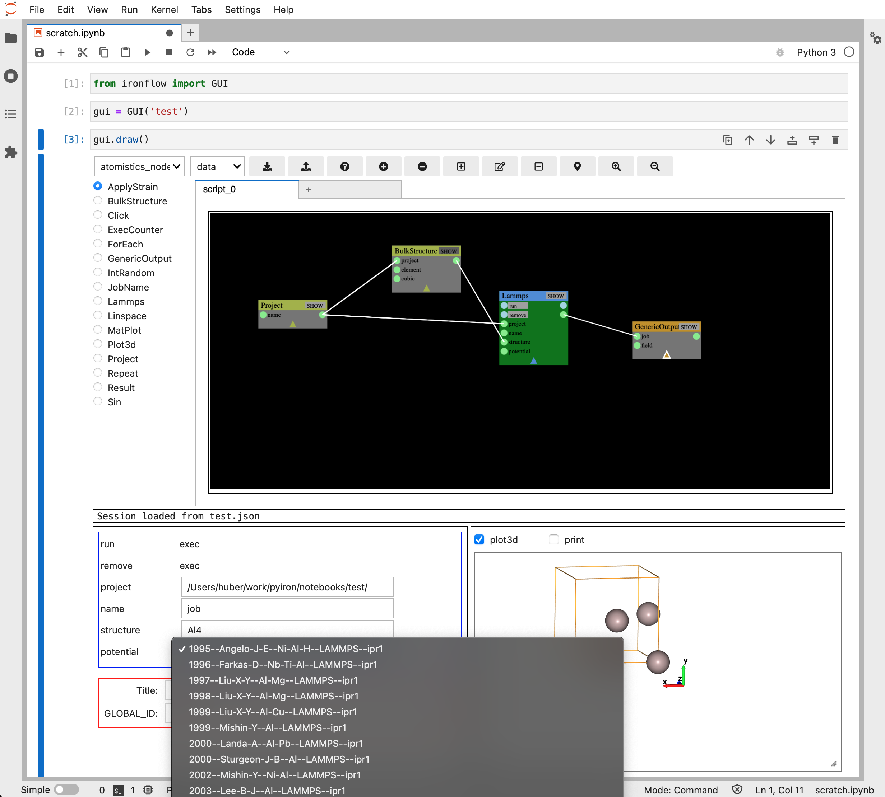

# Ironflow

[](https://mybinder.org/v2/gh/pyiron/ironflow/HEAD?labpath=example.ipynb)
[](https://opensource.org/licenses/BSD-3-Clause)
[](https://www.codacy.com/gh/pyiron/ironflow/dashboard?utm_source=github.com&amp;utm_medium=referral&amp;utm_content=pyiron/ironflow&amp;utm_campaign=Badge_Grade)

Ironflow combines [ryven](https://ryven.org), [ipycanvas](https://ipycanvas.readthedocs.io/) and [ipywidgets](https://ipywidgets.readthedocs.io/en/stable/) to provide a Jupyter-based visual scripting gui for running [pyiron](https://pyiron.org) workflow graphs.
This project is under active development, and in particular the set of nodes available for the workflow graphs is still limited. 
If there is a particular use-case you'd like to see, or if one of our nodes is not working as expected, please raise an issue!



## Usage

The main gui can be imported directly from `ironflow`.

The gui takes a session title at instantiation, and will automatically try to load any saved session (a JSON file) with the same name present.
To visualize the gui, call the `draw` method.
E.g.:
```python
from ironflow import GUI
gui = GUI('example')
gui.draw()
```

In addition to manipulating the gui with buttons in the toolbar, you can:
- Look at a node's IO values by clicking on it (which selects it)
- Deselect things by clicking on empty space
- See a richer representation of the node by clicking its `SHOW` button
- Connect the IO (input/output) of a node by clicking on its port and then clicking on another node's OI port
- Move a node around by clicking and dragging it
- Pan the entire camera around by clicking and dragging empty space
- Add a new node of the selected type by double-clicking on empty space
- Delete a node by double-clicking on it
- Collapse or expand a node by clicking on the little triangle on its body (has no effect on functionality, just makes it take less space)

In the default `data` execution mode (we don't currently do anything with the `exec` mode, so don't worry about it), nodes will update their output whenever their input data changes.
You'll see the node body change color when it's performing this update.
Some nodes have input (or output) ports that are of the execution rather than data type.
These can be triggered by a signal from another node's exec-type output port, or by manually clicking the button associated with that port right there in the node widget.

### Adding custom nodes

The tools needed for extending your graphs with new custom nodes can be imported from `ironflow.custom_nodes`.
New nodes can be registered either from a list of nodes, or from a python module or .py file.
In the latter two cases, only those nodes that inherit from `Node` *and* have a class name ending in `_Node` will be registered (this allows you to have your own node class templates and avoid loading the template itself by simply using regular python CamelCase naming conventions and avoiding ending in `_Node`). 

A new node should have a `title` and may optionally have input and/or output channels specified.
If you want your node to actually *do* something, you'll also need to define an `update_event` method.
E.g.:

```python
from ironflow.custom_nodes import Node, NodeInputBP, NodeOutputBP, dtypes, input_widgets

class My_Node(Node):
    title = "MyUserNode"
    init_inputs = [
        NodeInputBP(dtype=dtypes.Integer(default=1), label="foo")
    ]
    init_outputs = [
       NodeOutputBP(label="bar")
    ]
    color = 'cyan'

    def update_event(self, inp=-1):
        self.set_output_val(0, self.input(0) + 42)

gui.register_node(My_Node)
```

Ironflow nodes differ from standard ryven nodes in three ways:
- There is a new helper method `output` analogous to the existing `input` method that lets you more easily access output values, i.e. just a quality-of-life difference.
- They have a `representation` dictionary, which is used by the IPython gui front-end to give a richer look at nodes -- but this just defaults to all the outputs, so you don't need to touch it if you don't want to.
- They have two new events: `before_update` and `after_update`, to which you can connect (e.g. `node.after_update.connect`) or disconnect (`...disconnect`) methods to fire before and/or after updates occur -- such methods must take the node instance itself as the first argument, and the canonical input integer (specifying which input value it is that's updating) as the second argument. (You can see an example of this in our base `Node` class, where we use it to force an update of the `representation` attribute after each node update.)

Otherwise, they are just standard ryven nodes, and all the ryven documentation applies.

## Structure

The code is broken into three main submodules:
- `model`, which provides and interface to and extensions of the ryven back-end
- `gui`, which has all the code for driving the back-end from the IPython visual interface
- `nodes`, which stores all the nodes that get included by default when you instantiate the gui/model

There is also a `custom_nodes` submodule, but this just exposes other parts of the code base in one easy-to-improt-from spot.

The model itself, `HasSession`, is just a driver for a single ryven `Session`, with some helpful tools like the ability to easily register new nodes.
The only ryven element we currently extend is the `Node` class, as discussed above; other components are just imported directly from `ryvencore` in `ironflow.model.__init__`.

The gui inherits from a drives the model.
The visual elements of the gui are broken down into subcomponents like the toolbar, a panel with a visual representaiton of the graph, a place to show the node representations, etc.
We avoid listing them all here because what's included and how it's laid out is still in flux.
The key conceptual bit is that these various sub-components do not rely directly on eachother's internal implementation, they go through the gui as an intermediary.