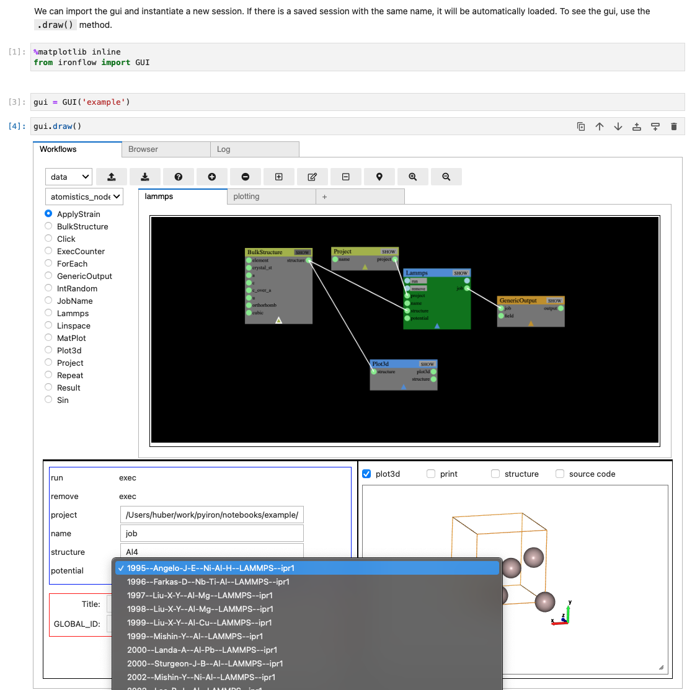

.. ironflow documentation master file

.. _index:

=========
ironflow
=========

.. image:: https://mybinder.org/badge_logo.svg
    :target: https://mybinder.org/v2/gh/pyiron/ironflow/HEAD?labpath=example.ipynb
    :alt: Launch MyBinder

.. image:: https://img.shields.io/badge/License-BSD_3--Clause-blue.svg
    :target: https://opensource.org/licenses/BSD-3-Clause
    :alt: License

.. image:: https://app.codacy.com/project/badge/Grade/f21027e6a1fd40bd8ff93b0314a64725
    :target: https://www.codacy.com/gh/pyiron/ironflow/dashboard
    :alt: Codacy

.. image:: https://coveralls.io/repos/github/pyiron/ironflow/badge.svg?branch=main
    :target: https://coveralls.io/github/pyiron/ironflow?branch=main
    :alt: Coveralls test coverage

.. image:: https://anaconda.org/conda-forge/ironflow/badges/version.svg
    :target: https://anaconda.org/conda-forge/ironflow
    :alt: Anaconda

.. image:: https://anaconda.org/conda-forge/ironflow/badges/latest_release_date.svg
    :target: https://anaconda.org/conda-forge/ironflow
    :alt: Last updated

.. image:: https://anaconda.org/conda-forge/ironflow/badges/platforms.svg
    :target: https://anaconda.org/conda-forge/ironflow
    :alt: Platform

.. image:: https://anaconda.org/conda-forge/ironflow/badges/downloads.svg
    :target: https://anaconda.org/conda-forge/ironflow
    :alt: Downloads

Ironflow combines `ryven <https://ryven.org>`_, `ipycanvas <https://ipycanvas.readthedocs.io/>`_ and `ipywidgets <https://ipywidgets.readthedocs.io/en/stable/>`_ to provide a Jupyter-based visual scripting gui for running `pyiron <https://pyiron.org>`_ workflow graphs.

.. toctree::
   :hidden:

   source/indices.rst